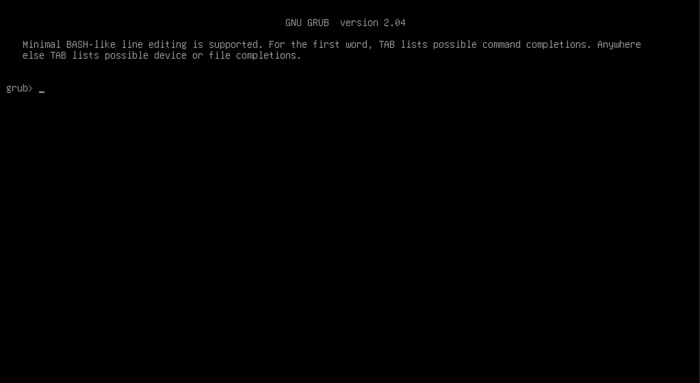
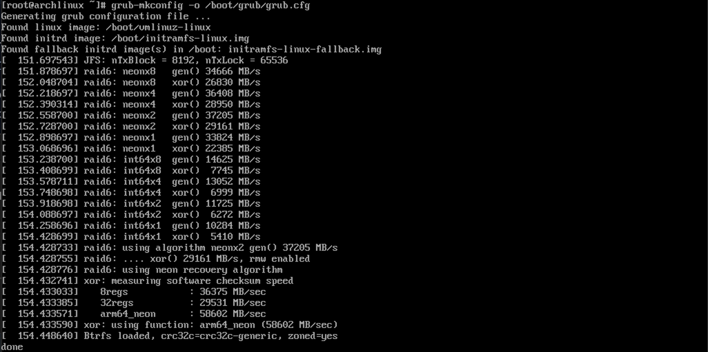
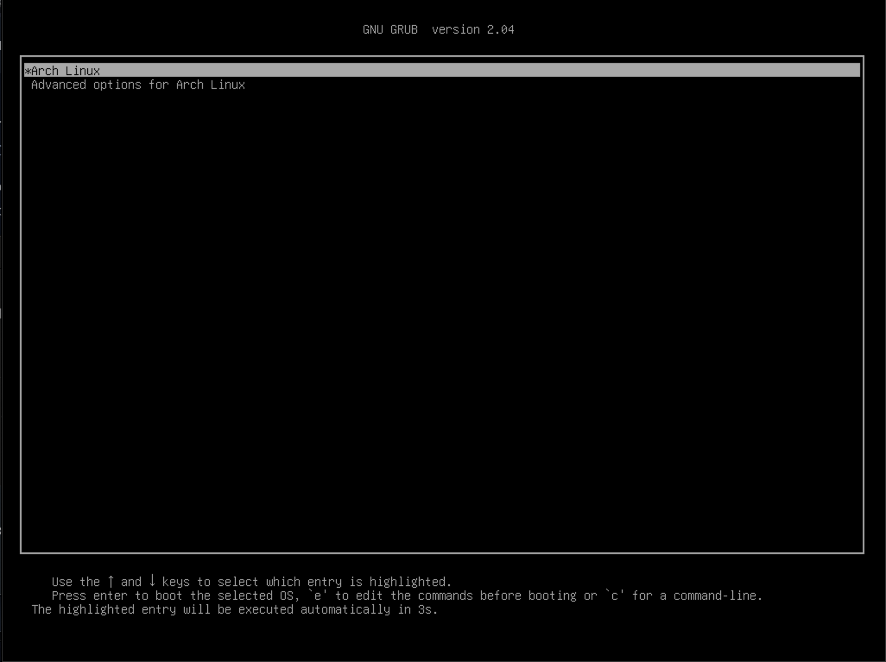

+++
title = "Arch Linux... for Mac"
author = "Madeline Robinson"
# description = "Running Arch Linux on an M1 MacBook."
date = 2021-06-09T21:45:00-06:00
draft = false

[taxonomies]
categories = ["Tutorial", "Troubleshooting", "Virtual Machine"]
tags = ["arch", "linux", "vm", "virtual machine", "m1", "arm", "mac", "macos", "Parallels"]
[extra]
toc = true
keywords = "Arch, Linux, Mac"
# thumbnail = "ferris-gesture.png"
+++

Do I start calling myself an Arch user _before_ or _after_ I complete the installation procedure?

I recently set it in my heart to try out a Linux distro. I'm planning to run a few small-time servers on Raspberry Pi boards, and I wasn't sure Raspbian would be right for what I'm trying to do. I learned from [the interwebs](https://youtu.be/rRdThUE0SMA) that Arch Linux is pretty great for DIY fans (such as myself most days). My favorite points are these:

- **Arch is very light.** There's not even any desktop environment out of the box. You gotta set that up yourself.
- **Everything your Arch installation does, you told it to do.** There's nothing in the way of anything you want to install to your system. No conventional dependencies of the platform (other than your kernel of choice); no running background processes to eat up precious resources; no bloatware or spyware; nothing to get in in the way of you setting up _your_ computer how _you_ want it to be. This is _your_ tool to use as you please!
- **The community is awesome.** I cannot verify this. Being the shy fool that I am, I mainly went the read-the-manual route. I cannot vouch for the it myself, but I've heard no bad things about the Arch community.

I'd heard the name "Arch Linux" thrown around, normally in reference to the meme about Arch users' alleged propensity for bragging about their OS of choice. I learned today what might give rise to such pride, and why it might be deserved (for a month or two) after _successfully_ installing and running Arch.

Practice makes permanent, and perfect practice makes perfect. I figure if I can install Arch on my computer under a VM, then I can do it on a Raspberry Pi. So, off to the books I went!

## Prerequesites

I'm in a bit of an odd place with this one. I run a Macintosh on the daily. [One of the schmancy new M1 models.](https://support.apple.com/kb/SP824) This makes certain things difficult. For example, M1 has an ARM architecture. I need:

- to run Arch on an ARM processor,
- to run Arch on a Mac without compromising my everyday use of macOS,
- to learn how the hay to use Arch.

I won't bore you with the troubleshooting trouble that got this project working. Suffice it to say that this project took hours of trial and error at each stage, and expertise beyond my own to finally get to a bootable installation.

I used Parallels Desktop as my virtual machine, mainly because it was the first VM that I could find that (1) has native M1 Mac support and (2) is familiar to me.

## The Steps

The first step is to get an installer. Arch for ARM is available in several flavors, depending on the target platform. There is still work being done on a version for M1, so I had to do some digging. There is a [Generic AArch64 Installation](https://archlinuxarm.org/platforms/armv8/generic) available, but the site doesn't provide a discrete .iso file that I can just plug-and-run in Parallels. If you don't know how to create an .iso from a .tar.gz file, and feel like an idiot for it, you are not alone. I spent hours on this problem, and eventually stumbled on [this fork](https://github.com/IComplainInComments/archiso) of `archiso`. (I think `archiso` is what the Generic .iso is meant to contain.) The [latest release](https://github.com/IComplainInComments/archiso/releases/tag/v1.0-Beta) (as of today) contains a downloadable .iso file that I guess makes the changes necessary to run the bootable Arch installer on M1!

That covers the first step of the official [Installation Guide](https://wiki.archlinux.org/title/Installation_guide). This guide is pretty swick on its own! These instructions work fairly well as stated therein, and I followed these instructions to the letter with only a few exceptions.

Some of the highly involved steps—like partitioning the disk and setting up the bootloader—are not covered in the Installation Guide in any detail. I used [this TecMint blog post](https://www.tecmint.com/arch-linux-installation-and-configuration-guide/) to teach me those bits. I ended up setting up the GRUB bootloader, as these directions describe.

One important deviation I should mention is that after I mounted the EFI partition temporarily to /boot/EFI, I ran the following command instead of what TechMint says:

```bash
grub-install --target=arm64-efi --efi-directory=/boot/EFI --bootloader-id="Arch Linux"
```

In essence, I targeted ARM instead of x86, and named the installation "Arch Linux" instead of "GRUB".

If you followed the instructions that I did, under the same system, your VM should have shown you the following screen:


_This is what happens when GRUB doesn't know what to boot._

## The Research (the boring bits)

I did _a lot_ of Googling here. I also enlisted the help of a friend whom I will call G. I don't understand this very well yet, so I'll condense our findings into what I consider to be the most actionable bits.

The best I found on my own was [this StackExchange answer](https://askubuntu.com/a/1175786) which described pointing GRUB to the right disk partition and initiating boot. These instructions did not work for me at all, but were informative to me on how the GRUB shell works. It took some sleuthing around (under G's experienced guidance) in the installer shell with `efibootmgr -v` and `grub-mkconfig -o /boot/grub/grub.cfg` to get this thing working.

To get the system to boot, I needed to run these commands in the `grub` prompt:

```sh
set root=(hd0,gpt3)
linux /boot/Image root=/dev/sda3
initrd /boot/initramfs-linux.img
boot
```

Once we got the system booted, we could do some more sleuthing, and possibly fix it!

## The Problem

We learned that, While GRUB could find the boot disk in /dev/sda3 just fine, it could not locate the Linux kernel on that disk!

The idea, so far as I understand it, is that `grub-mkconfig` is supposed to generate a list of available installations from which GRUB should boot. The kernel as we found it on my system was at /boot/Image. For Arch, GRUB expects to find the kernel at /boot/vmlinuz-linux. Since our image was named incorrectly—or `grub-mkconfig` isn't smart enough to check at /boot/Image—generated an empty list of bootable installations. At boot time, GRUB didn't know any better than to plop me at its prompt.

## The Resolution

The fix turned out to be as simple as renaming /boot/Image to /boot/vmlinuz-linux. A simple `cp` command to copy the kernel to the right place did the trick. Once I regenerated the GRUB config, all was well!

```bash
cp /boot/Image /boot/vmlinuz-linux
grub-mkconfig -o /boot/grub/grub.cfg
```

I used `cp` and not `mv` here because I didn't trust myself to not mess up the kernel. I might delete /boot/Image one day, but not today. 😅


_It found the kernel! I'm so proud_

On reboot I _finally_ get to see this screen:


_The boot menu_

My Arch VM now boots reliably! Thanks to G's indispensable help and troubleshooting prowess, I am now a brand-new Arch user.

## Helpful Resources

Now that my computer runs Arch, I should learn up how to use this new system effectively. My friend G recommended to me this Wiki article on how to use Pacman (Arch's awesome package manager) in terms familiar to other package managers: [pacman/Rosetta](https://wiki.archlinux.org/title/Pacman/Rosetta).
