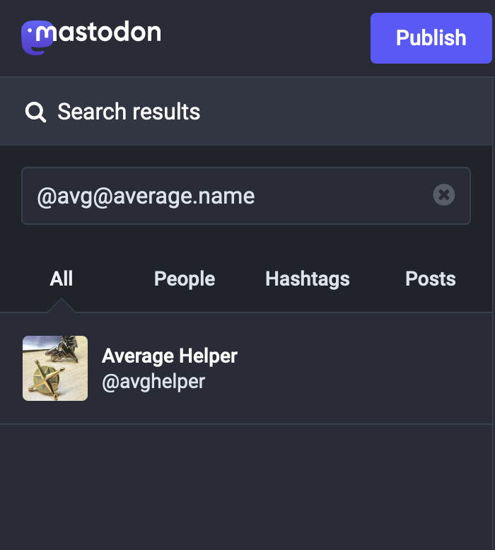

+++
title = "WebFinger Protocol on Nginx"
author = "Madeline Robinson"
description = "A modern application of an old web protocol."
date = 2022-12-29T12:00:00-06:00
draft = false

[taxonomies]
categories = ["Nginx", "Tutorial"]
tags = ["cloud", "protocols", "standards", "web", "internet", "tutorial"]
[extra]
toc = true
keywords = "Nginx, WebFinger, spec, specification"
thumbnail = "img/searching-avg-name-mastodon.png"
+++

# TL;DR

You can alias your Mastodon profile using your own domain.

# Background

I started using [Mastodon](https://joinmastodon.org/) recently, for reasons that I hope are obvious to anyone who's been on Twitter recently. The idea of a federated microblogging platform is intriguing to me. The way Mastodon servers talk to each other promotes interoperable systems on the internet, the way I think the internet was meant to be. (_Who needs Web3? Ha!_)

One interesting feature of Mastodon I discovered recently has to do with the [WebFinger](https://webfinger.net/) protocol.

# What's it do?

Basically, if you have a profile anywhere in the Fediverse, you can alias to that profile via your own website.

For example, I have a domain at [average.name](https://average.name). I also have a Mastodon profile at [fosstodon.org](https://fosstodon.org/about), but I might not always have my profile there, so in case I move, I don't want to have to change my profile listing everywhere I post it. I don't (yet) have my own Mastodon instance, but I _can_ configure my own website to act like an alias to my Mastodon profile!

This way, I can tell you to search for me from your home instance (the Mastodon site with which you have an account) at "@avg@average.name", and you would find my profile, wherever that may be!


_This is what you would see if you search for me and your home instance is [fosstodon.org](https://fosstodon.org/about)._

# Caveats

There's one minor flaw I've noticed (so far). While every Mastodon instance I've seen has an option to search for profiles, and they'll return results from anywhere in the fediverse that they can see, searching for me at my own domain, not by my Mastodon handle, when you're not signed in, returns nothing. No results. Zipp. Zero. Nada.

To work around this, rather than saying "_find_ me on Mastodon at _@avg@average.name_," I'd say "_follow_ me on Mastodon at _@avg@average.name_." Folks not used to Mastodon might get confused anyway, but I'd bet most of those would simply click one of the many links to my Mastodon profile out in the wild and not worry about it.

# How to set this up?

There's some magic involved here. Mastodon doesn't _assume_ any verified URL on your profile can be used as a profile domain alias, for reasons that are obvious to most web engineers.

Be warned, this is the boring part. Feel free to stop reading if all you wanted was to know why that Mastodon handle you found from one domain points in search to a profile on a completely different domain. On to the technical bits.

I'll leave learning the gory details of the [WebFinger spec](https://www.rfc-editor.org/rfc/rfc7033) as an exercise to the reader. I even read it myself, all I know is enough to get this one neat Mastodon feature to work. My only goal was to have a search for "@avg@average.name" and related strings to return my profile, wherever that may be in the Fediverse.

Unfortunately, the spec relies on HTTP requests, and not the kind that can be handled with static files alone. If you're following along at home, you'll need to figure out how to do this for your own webserver. I use [Nginx](https://www.nginx.com/) for [average.name](https://average.name).

For reference, I adapted [this tutorial](https://willnorris.com/2014/07/webfinger-with-static-files-nginx/) as a basic primer for WebFinger on Nginx, and used [this neat tutorial](https://www.hanselman.com/blog/use-your-own-user-domain-for-mastodon-discoverability-with-the-webfinger-protocol-without-hosting-a-server) as an example of how Mastodon is supposed to work once I'm done. Go check them out!

Basic requirements for my purposes:

- A request for any of my personal public handles returns a standard WebFinger response (a static `webfinger.json` file).
- A request for an unknown `resource` returns [HTTP 404 (Not Found)](https://developer.mozilla.org/en-US/docs/Web/HTTP/Status/404).
- A request with a missing or malformed `resource` parameter returns [HTTP 400 (Bad Request)](https://developer.mozilla.org/en-US/docs/Web/HTTP/Status/400).
- My response has a "content type" of `application/jrd+json`.
- My response includes the proper CORS headers.

I'll be honest, I didn't need much trial or error here, given the prior work on this that I've already linked above. Here's the relevant bits of the Nginx config I used:

```conf
location = /.well-known/webfinger {
	# Allow only GET and HEAD methods (not spec, but seems a good idea)
	if ($request_method !~ ^(GET|HEAD)$)  { return 405; }

	# Parse the "resource" param
	set_by_lua $resource 'return ngx.unescape_uri(ngx.req.get_uri_args()["resource"])';

	# Missing or empty resource is 400
	if ($resource = "")  { return 400; }

	# Handle website
	if ($resource = "https://average.name")  { rewrite .* /webfinger.json last; }
	if ($resource = "https://average.name/")  { rewrite .* /webfinger.json last; }

	# Handle Mastodon
	if ($resource = "acct:avg@average.name")  { rewrite .* /webfinger.json last; }
	if ($resource = "acct:avghelper@average.name")  { rewrite .* /webfinger.json last; }
	if ($resource = "acct:average@average.name")  { rewrite .* /webfinger.json last; }
	if ($resource = "acct:https://average.name/@avg")  { rewrite .* /webfinger.json last; }
	if ($resource = "acct:https://average.name/@avghelper")  { rewrite .* /webfinger.json last; }
	if ($resource = "acct:https://average.name/@average")  { rewrite .* /webfinger.json last; }

	# TODO: Handle email, Twitter, GitHub, and anything else that's "me"

	# Nginx returns 404 implicitly if nothing else matches
}

# Set appropriate headers for webfinger.json document
location = /webfinger.json {
	types { application/jrd+json json; }
	add_header Access-Control-Allow-Origin "*";
}
```

After that, all I needed was to add a new webfinger.json file at the root of my site, and Mastodon does the rest! I'll leave that as an exercise to the reader. (Or, you can go look at mine, it's public anyway lol).

I suppose it's possible for anyone to do the same thing, and copy my WebFinger responses onto their own site and claim to be me. That's a lot of work, and it's rude, but I cannot stop you. I hope you won't ("Identity theft is not a joke, _Jim!_"). As a basic disclaimer, it should be known that only WebFinger responses from my own site (that is, [average.name](https://average.name)) are actually from me. My Mastodon profile has that site highlighted as "verified," as it is indeed my site.

[](https://fosstodon.org/@avghelper)
_My website, average.name, marked "verified" on my Mastodon profile._

# Conclusion

I love web standards like this, that promote cooperation between otherwise disparate systems. More of these, please!
